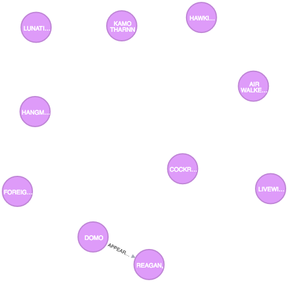
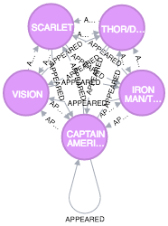
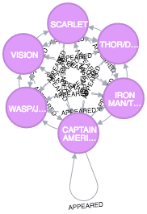
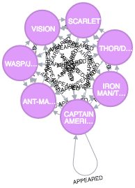
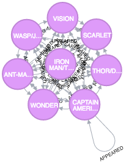
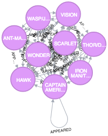
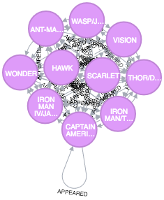

1. What is the shortest path between DR. STRANGE and DR. DOOM?

 ```
 MATCH (strange:Hero {name:"DR. STRANGE/STEPHEN"}), (doom:Hero {name:"DR. DOOM/VICTOR VON"})
 MATCH p=shortestPath((strange)-[:APPEARED*]-(doom))
 RETURN p
 ```

 

2. List the 5 shortest paths between DR. STRANGE and DR. DOOM

 ```
 MATCH (strange:Hero {name:"DR. STRANGE/STEPHEN"}), (doom:Hero {name:"DR. DOOM/VICTOR VON"})
 MATCH p=((strange)-[:APPEARED*0..2]-(doom))
 RETURN p, length(p)
 ORDER BY length(p)
 LIMIT 5
 ```
 ```
 ╒═════════════════════════════════════════════════════════╤═══════════╕
 │"p"                                                      │"length(p)"│
 ╞═════════════════════════════════════════════════════════╪═══════════╡
 │[{"name":"DR. STRANGE/STEPHEN","degree":"777"},{"w":"8"},│"1"        │
 │{"name":"DR. DOOM/VICTOR VON","degree":"441"}]           │           │
 ├─────────────────────────────────────────────────────────┼───────────┤
 │[{"name":"DR. STRANGE/STEPHEN","degree":"777"},{"w":"12"}│"1"        │
 │,{"name":"DR. DOOM/VICTOR VON","degree":"441"}]          │           │
 ├─────────────────────────────────────────────────────────┼───────────┤
 │[{"name":"DR. STRANGE/STEPHEN","degree":"777"},{"w":"2"},│"2"        │
 │{"name":"THUNDERBALL/DR. ELIO","degree":"138"},{"name":"T│           │
 │HUNDERBALL/DR. ELIO","degree":"138"},{"w":"6"},{"name":"D│           │
 │R. DOOM/VICTOR VON","degree":"441"}]                     │           │
 ├─────────────────────────────────────────────────────────┼───────────┤
 │[{"name":"DR. STRANGE/STEPHEN","degree":"777"},{"w":"2"},│"2"        │
 │{"name":"THUNDERBALL/DR. ELIO","degree":"138"},{"name":"T│           │
 │HUNDERBALL/DR. ELIO","degree":"138"},{"w":"6"},{"name":"D│           │
 │R. DOOM/VICTOR VON","degree":"441"}]                     │           │
 ├─────────────────────────────────────────────────────────┼───────────┤
 │[{"name":"DR. STRANGE/STEPHEN","degree":"777"},{"w":"1"},│"2"        │
 │{"name":"PAGE, KAREN","degree":"188"},{"name":"PAGE, KARE│           │
 │N","degree":"188"},{"w":"1"},{"name":"DR. DOOM/VICTOR VON│           │
 │","degree":"441"}]                                       │           │
 └─────────────────────────────────────────────────────────┴───────────┘
  ```

3. List 5 Friends of Friends with the most connections and COLOSSUS II.

 ```
 MATCH (colossus:Hero { name: 'COLOSSUS II/PETER RA' })-[:APPEARED*2..2]-(friend_of_friend)
 WHERE NOT (colossus)-[:APPEARED]-(friend_of_friend)
 AND friend_of_friend.name <> 'COLOSSUS II/PETER RA'
 RETURN friend_of_friend.name, COUNT(*)
 ORDER BY COUNT(*) DESC , friend_of_friend.name
 LIMIT 5
 ```

 ```
 ╒═══════════════════════╤══════════╕
 │"friend_of_friend.name"│"COUNT(*)"│
 ╞═══════════════════════╪══════════╡
 │"WONG"                 │"453"     │
 ├───────────────────────┼──────────┤
 │"MOONSTONE II/KARLA S" │"370"     │
 ├───────────────────────┼──────────┤
 │"CARTER, PEGGY"        │"367"     │
 ├───────────────────────┼──────────┤
 │"POWER MAN/ERIK JOSTE" │"350"     │
 ├───────────────────────┼──────────┤
 │"KINGPIN/WILSON FISK"  │"342"     │
 └───────────────────────┴──────────┘
 ```

4. Visualize 10 Friends of friends for IRON MAN

 ```
 MATCH (tony:Hero { name: 'IRON MAN/TONY STARK' })-[:APPEARED*2..2]-(friend_of_friend)
 WHERE NOT (tony)-[:APPEARED]-(friend_of_friend)
 AND friend_of_friend.name <> 'IRON MAN/TONY STARK'
 RETURN friend_of_friend
 LIMIT 10
 ```

 

5. Discover how the Avengers grew over time from 5 to 10. Find team members starting with 5 and incrementing to 10. Who was added to the team? Is the resulting graph ever not fully connected?

 ```
 MATCH (tony:Hero {name:'IRON MAN/TONY STARK'}) -[e:APPEARED]-> (other) <-[f:APPEARED]- (donald:Hero {name:'THOR/DR. DONALD BLAK'})
 RETURN other, tony, donald
 ORDER BY e.w DESC, f.w DESC
 LIMIT 3
 ```

  

 ```
 MATCH (tony:Hero {name:'IRON MAN/TONY STARK'}) -[e:APPEARED]-> (other) <-[f:APPEARED]- (donald:Hero {name:'THOR/DR. DONALD BLAK'})
 RETURN other, tony, donald
 ORDER BY e.w DESC, f.w DESC
 LIMIT 4
 ```
 
 ```
 MATCH (tony:Hero {name:'IRON MAN/TONY STARK'}) -[e:APPEARED]-> (other) <-[f:APPEARED]- (donald:Hero {name:'THOR/DR. DONALD BLAK'})
 RETURN other, tony, donald
 ORDER BY e.w DESC, f.w DESC
 LIMIT 5
 ```
 
 ```
 MATCH (tony:Hero {name:'IRON MAN/TONY STARK'}) -[e:APPEARED]-> (other) <-[f:APPEARED]- (donald:Hero {name:'THOR/DR. DONALD BLAK'})
 RETURN other, tony, donald
 ORDER BY e.w DESC, f.w DESC
 LIMIT 6
 ```
 
 ```
 MATCH (tony:Hero {name:'IRON MAN/TONY STARK'}) -[e:APPEARED]-> (other) <-[f:APPEARED]- (donald:Hero {name:'THOR/DR. DONALD BLAK'})
 RETURN other, tony, donald
 ORDER BY e.w DESC, f.w DESC
 LIMIT 7
 ```
 
 ```
 MATCH (tony:Hero {name:'IRON MAN/TONY STARK'}) -[e:APPEARED]-> (other) <-[f:APPEARED]- (donald:Hero {name:'THOR/DR. DONALD BLAK'})
 RETURN other, tony, donald
 ORDER BY e.w DESC, f.w DESC
 LIMIT 8
 ```
 

The graphs are always fully connected.
