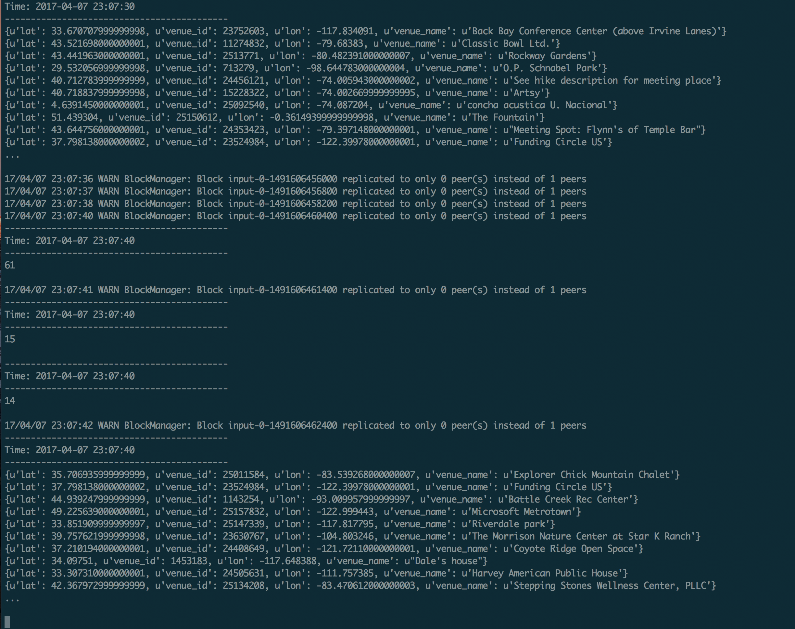

## Lab 10
### Chris Fleisch

1.
```
from pyspark import SparkContext
from pyspark.streaming import StreamingContext
ssc = StreamingContext(sc, 1)
lines= ssc.textFileStream("file:///tmp/datastreams")
wclines = lines.filter(lambda word: True if len(word) > 5  else False)
wclines.pprint()
ssc.start()
```

2.
```
from pyspark import SparkContext
from pyspark.streaming import StreamingContext
import json
ssc = StreamingContext(sc, 10)
lines = ssc.textFileStream("file:///tmp/datastreams")

def save_venues(x):
    f = open('myfile', 'a')
    print >>f, x
    f.close()
    return x

slines = lines.flatMap(lambda x: [ j['venue'] for j in json.loads('['+x+']') if 'venue' in j])
vlines = slines.map(lambda x: save_venues(x))

slines.pprint()
vlines.pprint()
ssc.start()
```

3.

To solve the burst problem, it might be helpful to write the data to a data store before processing so that if the volume of data increases too much the processing can still happen at a later time by pulling it off the data store as it can be processed. This would also help in the case that we need to update the processing. After the processing is updated only new data would be affected and older data would have been process by the older methods. By storing it we could rerun all the updated processing methods on the all the old data and new data.

4a.



4b.

Every 10 seconds you will get the count for the last 3 batches with a 30 second sliding window and 10 second batches.

With a 30 second sliding window and 30 second batches every 30 seconds you will get the count for the last 1 batch. There is no need for a sliding window you can just count the batch.
